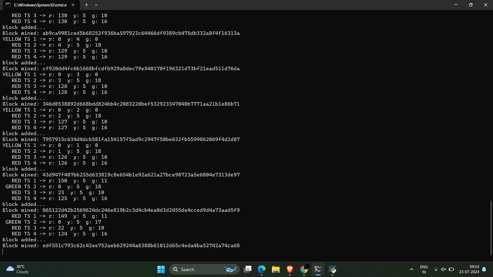

# BlockChain_Framework_For_Vehicular_Communication

A Cybersecurity Project For Making a secure and safe communication of the vehicular data between the vehicles using the ECC ( Eliptic Curve Cryptography ) Blockchain Algorithm .  
<html>
   

     <h1>Simmulation  </h1>
     
      
     
   

</html>
